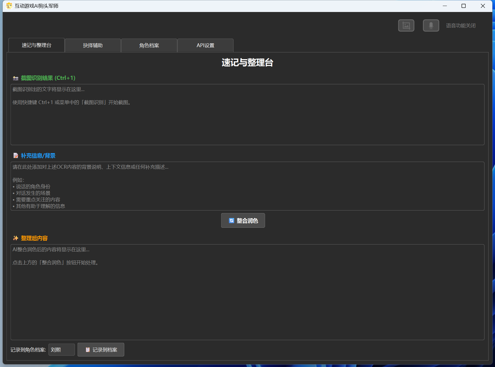
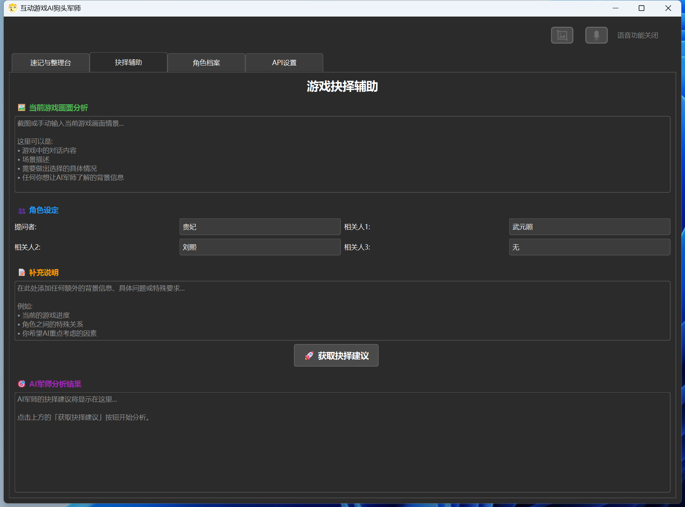
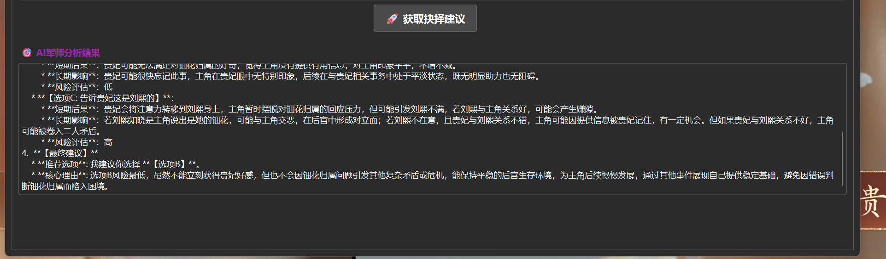

# 互动游戏AI狗头军师 (AI-Game-Strategist)

一款基于 PyQt6 的桌面助手，帮助玩家在游戏或直播过程中快速截图、整理笔记、记录角色档案，并通过自定义 API 进行 OCR / 多模态分析或语音转文字。适合“边玩边记录”“边分析边沟通”的使用场景。



## 功能亮点

- **全局截图热键**：
  - Alt+1 区域截图，弹出遮罩框选即可复制并触发后续流程；
  - Alt+2 直接抓取主屏，无需切换窗口；
  - 借助隐藏消息窗口监听 WM_HOTKEY，即使程序位于后台也能触发，窗口激活时仍保留普通快捷键作为兜底。
- **语音输入与转写**：Shift 键切换录音状态，基于 PyAudio，将语音发送到配置的语音识别 API。
- **角色档案与策略整理**：在“速记与整理台”中整合 OCR 文本、补充背景、生成结构化总结；角色档案页支持长期维护。
- **灵活 API 配置**：在“API 设置”页填写多模态 / 语音接口参数（兼容 OpenAI 风格），所有配置保存在本地 config.json。
- **一键打包 EXE**：内置 `build_exe.bat`，可快速生成含完整资源的 Windows 可执行文件。

## 示例截图






## 环境要求

- 系统：Windows 10 / 11（全局热键依赖 Win32 API）
- Python：3.8 及以上（推荐 3.10+）

## 安装依赖

1. （可选）创建并激活虚拟环境：
   `powershell
   python -m venv .venv
   .\.venv\Scripts\activate
   `
2. 安装项目所需库：
   `powershell
   pip install -U pip
   pip install PyQt6 requests pillow pyaudio
   `

## 从源码运行

`powershell
python main.py
`

首次运行会在 characters/、screenshots/ 下创建占位文件夹（使用 .gitkeep），界面右上角可开关语音功能并实时显示状态。

## 打包为 EXE

项目根目录提供 `build_exe.bat` 脚本，可按需选择模式：

- **保留控制台日志（推荐，便于排错）**
  ```powershell
  .\build_exe.bat
  ```
- **隐藏控制台（纯 GUI）**
  ```powershell
  .\build_exe.bat gui
  ```
- **生成单文件 EXE**（所有依赖打包到一个可执行文件中）
  ```powershell
  .\build_exe.bat onefile
  ```
- **单文件 + 隐藏控制台**
  ```powershell
  .\build_exe.bat gui onefile
  ```

脚本会自动：

1. 自动寻找 Python（优先 py -3，失败回退 python）。
2. 安装/更新 PyInstaller、PyQt6、requests、pillow、pyaudio。
3. 清理旧的 build/、dist/、.spec 文件。
4. 执行 PyInstaller，并用 --add-data assets;assets 将图标与图片一并复制。

打包完成后：

- **onedir（默认）模式**：产物位于 dist\AI-Game-Strategist\AI-Game-Strategist.exe，同级目录包含 assets/ 等运行时文件。
- **onefile 模式**：产物为 dist\AI-Game-Strategist.exe 单文件，首次启动会在临时目录解压。

向他人分发时：

- onedir 模式务必把整个 dist\AI-Game-Strategist\ 目录一起打包发送，切勿只拷贝 exe。
- onefile 模式只需提供单个 exe，但仍建议提醒对方安装 Microsoft Visual C++ 运行库，以避免缺少依赖。

## 目录结构

```
.
├── main.py                # 主程序入口，负责 UI 与全局热键
├── snipping_tool.py       # 自定义截图遮罩窗口
├── api_service.py         # OCR / 多模态 / 语音 API 封装
├── audio_processing.py    # 录音与转写逻辑
├── assets/                # 图标与 README 插图
├── characters/            # 角色档案（仅提交 .gitkeep）
├── screenshots/           # 截图输出目录（仅提交 .gitkeep）
├── build_exe.bat          # 一键打包脚本（仓库中唯一保留的 .bat）
└── README.md              # 使用说明
```

## 快捷键一览

| 快捷键   | 功能说明                                 |
|----------|------------------------------------------|
| Alt+1    | 区域截图   |
| Alt+2    | 全屏截图并进入分析流程                   |
| Shift    | 切换语音录制状态（需开启语音功能）       |

## 常见问题

- **双击 EXE 后直接关闭**：请在 PowerShell 中运行 dist/AI-Game-Strategist/AI-Game-Strategist.exe（onefile 模式运行 dist/AI-Game-Strategist.exe），查看输出的错误信息。
- **图标或资源丢失**：确认打包结果中存在 assets/ 目录（onedir 模式）或确保 exe 解压成功（onefile 模式）。
- **语音功能无响应**：检查麦克风权限，确认 pyaudio 安装成功。
- **API 不生效**：在“API 设置”页补全必填字段并保存，config.json 已在 .gitignore 中忽略。

## 版本控制说明

- .gitignore 已忽略 build/、dist/、各种日志以及除 `build_exe.bat` 外的所有 .bat 文件。
- 配置文件 config.json、个人笔记、运行时输出不会被提交。
- characters/、screenshots/ 仅提交 .gitkeep，实际资料保留在本地。

若后续扩展了新的 API 或工作流，欢迎同步更新 README.md 与 `build_exe.bat`，保持打包流程简单可靠。祝使用愉快！

## 最近更新记录

### v1.2.0 (2025-09-22)

**🎯 抉择辅助功能增强**
- 新增"参考所有角色档案"复选框，支持全局分析模式
- 勾选后自动禁用手动角色选择，AI将参考所有已创建的角色档案
- 添加tokens消耗提醒，帮助用户根据模型情况合理选择分析模式

**⚡ 快捷键优化**
- 将全局截图热键从 Ctrl+1/Ctrl+2 改为 Alt+1/Alt+2
- 按起来更顺手，提升用户体验

**🔧 交互体验改进**
- 修复角色创建取消时的状态恢复问题
- 优化无角色时的下拉列表显示
- 重构角色列表获取逻辑，代码更简洁

**🌐 API配置优化**
- 新增Google Gemini官方API支持
- 修复供应商切换时配置混乱问题
- 移除关闭应用时的强制保存操作

**🎨 UI细节优化**
- 修复下拉列表宽度显示问题
- 优化抉择辅助结果框的高度自适应
- 添加速记台快捷创建角色功能
- 增强整合润色功能的人名自动修正能力

### v1.3.0 (2025-09-22)

全新功能：风闻记录模块 🎙️

**✨ 全新“风闻记录”功能，打造动态事件时间线**
- 新增“风闻记录”核心模块:
- 利用语音识别，可录制并转录完整的游戏对话场景。
- 通过简单的UI配置（选择发言人、场景属性），即可调用AI将原始录音智能整理成带角色标注、条理清晰的对话实录。
- 所有记录保存在专属的 风闻.md 文件中，形成可追溯的游戏事件日志。

**⚡ “抉择辅助”功能深度进化**
- 新增“参考风闻记录”选项，让AI决策时能够读取并理解过去发生的所有关键事件。
- 决策Prompt引擎升级，融合了历史事件分析，使AI的建议更具深度和前瞻性，能更好地理解人物关系和长期动机。

**🔧 “角色档案”功能联动增强**
- 新增“查看风闻记录”按钮，可在角色档案页一键切换，方便地查阅完整的事件时间线，无需离开当前界面。
- 实现了视图状态管理，确保在查看风闻时禁用不相关的编辑操作，提升了交互的清晰度和安全性。
